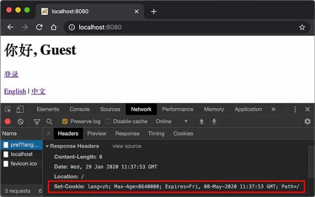

# Web开发
本文内容主要来自
https://www.liaoxuefeng.com/wiki/1252599548343744
如有侵权,请及时联系作者。

简介内容:
https://www.liaoxuefeng.com/wiki/1252599548343744/1255945497738400

## web基础
https://www.liaoxuefeng.com/wiki/1252599548343744/1304265903570978

## Servlet入门
要编写一个完善的HTTP服务器，以HTTP/1.1为例，需要考虑的包括：
>识别正确和错误的HTTP请求；
识别正确和错误的HTTP头；
复用TCP连接；
复用线程；
IO异常处理；
...

这些基础工作需要耗费大量的时间，并且经过长期测试才能稳定运行。如果我们只需要输出一个简单的HTML页面，就不得不编写上千行底层代码，那就根本无法做到高效而可靠地开发。

因此，在JavaEE平台上，处理TCP连接，解析HTTP协议这些底层工作统统扔给现成的Web服务器去做，我们只需要把自己的应用程序跑在Web服务器上。为了实现这一目的，JavaEE提供了Servlet API，我们使用Servlet API编写自己的Servlet来处理HTTP请求，Web服务器实现Servlet API接口，实现底层功能：
```

                 ┌───────────┐
                 │My Servlet │
                 ├───────────┤
                 │Servlet API│
┌───────┐  HTTP  ├───────────┤
│Browser│<──────>│Web Server │
└───────┘        └───────────┘
```

最简单的`Servlet`:
```java
// WebServlet注解表示这是一个Servlet，并映射到地址/:
@WebServlet(urlPatterns = "/")
public class HelloServlet extends HttpServlet {
    protected void doGet(HttpServletRequest req, HttpServletResponse resp)
            throws ServletException, IOException {
        // 设置响应类型:
        resp.setContentType("text/html");
        // 获取输出流:
        PrintWriter pw = resp.getWriter();
        // 写入响应:
        pw.write("<h1>Hello, world!</h1>");
        // 最后不要忘记flush强制输出:
        pw.flush();
    }
}
```
一个Servlet总是继承自`HttpServlet`，然后覆写`doGet()`或`doPost()`方法。注意到`doGet()`方法传入了`HttpServletRequest`和`HttpServletResponse`两个对象，分别代表HTTP请求和响应。我们使用Servlet API时，并不直接与底层TCP交互，也不需要解析HTTP协议，因为`HttpServletRequest`和`HttpServletResponse`就已经封装好了请求和响应。以发送响应为例，我们只需要设置正确的响应类型，然后获取`PrintWriter`，写入响应即可。

现在问题来了：Servlet API是谁提供？

Servlet API是一个jar包，我们需要通过Maven来引入它，才能正常编译。编写`pom.xml`文件如下：
```xml
<project xmlns="http://maven.apache.org/POM/4.0.0"
    xmlns:xsi="http://www.w3.org/2001/XMLSchema-instance"
    xsi:schemaLocation="http://maven.apache.org/POM/4.0.0 http://maven.apache.org/maven-v4_0_0.xsd">
    <modelVersion>4.0.0</modelVersion>
    <groupId>com.itranswarp.learnjava</groupId>
    <artifactId>web-servlet-hello</artifactId>
    <packaging>war</packaging>
    <version>1.0-SNAPSHOT</version>

    <properties>
        <project.build.sourceEncoding>UTF-8</project.build.sourceEncoding>
        <project.reporting.outputEncoding>UTF-8</project.reporting.outputEncoding>
        <maven.compiler.source>11</maven.compiler.source>
        <maven.compiler.target>11</maven.compiler.target>
        <java.version>11</java.version>
    </properties>

    <dependencies>
        <dependency>
            <groupId>javax.servlet</groupId>
            <artifactId>javax.servlet-api</artifactId>
            <version>4.0.0</version>
            <scope>provided</scope>
        </dependency>
    </dependencies>

    <build>
        <finalName>hello</finalName>
    </build>
</project>
```

注意到这个`pom.xml`与前面我们讲到的普通Java程序有个区别，打包类型不是`jar`，而是`war`，表示Java Web Application Archive：
```xml
<packaging>war</packaging>
```
引入的Servlet API如下：
```xml
<dependency>
    <groupId>javax.servlet</groupId>
    <artifactId>javax.servlet-api</artifactId>
    <version>4.0.0</version>
    <scope>provided</scope>
</dependency>
```
注意到<scope>指定为`provided`，表示编译时使用，但不会打包到`.war`文件中，因为运行期Web服务器本身已经提供了Servlet API相关的jar包。

我们还需要在工程目录下创建一个web.xml描述文件，放到src/main/webapp/WEB-INF目录下（固定目录结构，不要修改路径，注意大小写）。文件内容可以固定如下：

```xml
<!DOCTYPE web-app PUBLIC
 "-//Sun Microsystems, Inc.//DTD Web Application 2.3//EN"
 "http://java.sun.com/dtd/web-app_2_3.dtd">
<web-app>
  <display-name>Archetype Created Web Application</display-name>
</web-app>
```
整个工程结构如下：
```
web-servlet-hello
├── pom.xml
└── src
    └── main
        ├── java
        │   └── com
        │       └── itranswarp
        │           └── learnjava
        │               └── servlet
        │                   └── HelloServlet.java
        ├── resources
        └── webapp
            └── WEB-INF
                └── web.xml
```
## Servlet进阶
一个Web App就是由一个或多个Servlet组成的，每个Servlet通过注解说明自己能处理的路径。例如：
```java
@WebServlet(urlPatterns = "/hello")
public class HelloServlet extends HttpServlet {
    ...
}
```
因为浏览器发送请求的时候，还会有请求方法（HTTP Method）：即GET、POST、PUT等不同类型的请求。因此，要处理GET请求，我们要覆写doGet()方法：
```java
@WebServlet(urlPatterns = "/hello")
public class HelloServlet extends HttpServlet {
    @Override
    protected void doGet(HttpServletRequest req, HttpServletResponse resp) throws ServletException, IOException {
        ...
    }
}
```
类似的，要处理POST请求，就需要覆写`doPost()`方法。
如果没有覆写`doPost()`方法，那么`HelloServlet`能不能处理`POST /hello`请求呢？
我们查看一下`HttpServlet`的`doPost()`方法就一目了然了：它会直接返回405或400错误。因此，一个Servlet如果映射到`/hello`，那么所有请求方法都会由这个Servlet处理，至于能不能返回200成功响应，要看有没有覆写对应的请求方法。
一个Webapp完全可以有多个Servlet，分别映射不同的路径。例如：
```java
@WebServlet(urlPatterns = "/hello")
public class HelloServlet extends HttpServlet {
    ...
}

@WebServlet(urlPatterns = "/signin")
public class SignInServlet extends HttpServlet {
    ...
}

@WebServlet(urlPatterns = "/")
public class IndexServlet extends HttpServlet {
    ...
}
```
浏览器发出的HTTP请求总是由Web Server先接收，然后，根据Servlet配置的映射，不同的路径转发到不同的Servlet：
```
               ┌ ─ ─ ─ ─ ─ ─ ─ ─ ─ ─ ─ ─ ─ ─ ─ ─ ─ ─ ─ ┐

               │            /hello    ┌───────────────┐│
                          ┌──────────>│ HelloServlet  │
               │          │           └───────────────┘│
┌───────┐    ┌──────────┐ │ /signin   ┌───────────────┐
│Browser│───>│Dispatcher│─┼──────────>│ SignInServlet ││
└───────┘    └──────────┘ │           └───────────────┘
               │          │ /         ┌───────────────┐│
                          └──────────>│ IndexServlet  │
               │                      └───────────────┘│
                              Web Server
               └ ─ ─ ─ ─ ─ ─ ─ ─ ─ ─ ─ ─ ─ ─ ─ ─ ─ ─ ─ ┘
```
这种根据路径转发的功能我们一般称为Dispatch。映射到`/`的`IndexServlet`比较特殊，它实际上会接收所有未匹配的路径，相当于`/*`，因为Dispatcher的逻辑可以用伪代码实现如下：
```
String path = ...
if (path.equals("/hello")) {
    dispatchTo(helloServlet);
} else if (path.equals("/signin")) {
    dispatchTo(signinServlet);
} else {
    // 所有未匹配的路径均转发到"/"
    dispatchTo(indexServlet);
}
```
所以我们在浏览器输入一个`http://localhost:8080/abc` 也会看到   `IndexServlet`生成的页面。
### HttpServletRequest
`HttpServletRequest`封装了一个HTTP请求，它实际上是从`ServletRequest`继承而来。最早设计Servlet时，设计者希望Servlet不仅能处理HTTP，也能处理类似SMTP等其他协议，因此，单独抽出了`ServletRequest`接口，但实际上除了HTTP外，并没有其他协议会用Servlet处理，所以这是一个过度设计。

我们通过`HttpServletRequest`提供的接口方法可以拿到HTTP请求的几乎全部信息，常用的方法有：
getMethod()：返回请求方法，例如，`"GET"`，`"POST"`；
getRequestURI()：返回请求路径，但不包括请求参数，例如，`"/hello"`；
getQueryString()：返回请求参数，例如，`"name=Bob&a=1&b=2"`；
getParameter(name)：返回请求参数，GET请求从URL读取参数，POST请求从Body中读取参数；
getContentType()：获取请求Body的类型，例如，`"application/x-www-form-urlencoded"`；
getContextPath()：获取当前Webapp挂载的路径，对于ROOT来说，总是返回空字符串""；
getCookies()：返回请求携带的所有Cookie；
getHeader(name)：获取指定的Header，对Header名称不区分大小写；
getHeaderNames()：返回所有Header名称；
getInputStream()：如果该请求带有HTTP Body，该方法将打开一个输入流用于读取Body；
getReader()：和getInputStream()类似，但打开的是Reader；
getRemoteAddr()：返回客户端的IP地址；
getScheme()：返回协议类型，例如，`"http"`，`"https"`；

此外，`HttpServletRequest`还有两个方法：`setAttribute()`和`getAttribute()`，可以给当前`HttpServletRequest`对象附加多个Key-Value，相当于把`HttpServletRequest`当作一个`Map<String, Object>`使用。
调用`HttpServletRequest`的方法时，注意务必阅读接口方法的文档说明，因为有的方法会返回null，例如`getQueryString()`的文档就写了：
```
... This method returns null if the URL does not have a query string...
```

### HttpServletResponse
`HttpServletResponse`封装了一个HTTP响应。由于HTTP响应必须先发送Header，再发送Body，所以，操作`HttpServletResponse`对象时，必须先调用设置Header的方法，最后调用发送Body的方法。
常用的设置Header的方法有：
setStatus(sc)：设置响应代码，默认是`200`；
setContentType(type)：设置Body的类型，例如，`"text/html"`；
setCharacterEncoding(charset)：设置字符编码，例如，`"UTF-8"`；
setHeader(name, value)：设置一个Header的值；
addCookie(cookie)：给响应添加一个Cookie；
addHeader(name, value)：给响应添加一个Header，因为HTTP协议允许有多个相同的Header；
服务器每一行均返回一个HTTP头。服务器经常返回的HTTP Header包括：
Content-Type：表示该响应内容的类型，例如`text/html`，`image/jpeg`；
Content-Length：表示该响应内容的长度（字节数）；
Content-Encoding：表示该响应压缩算法，例如`gzip`；
Cache-Control：指示客户端应如何缓存，例如`max-age=300`表示可以最多缓存300秒。
HTTP请求和响应都由HTTP Header和HTTP Body构成，其中HTTP Header每行都以`\r\n`结束。如果遇到两个连续的`\r\n`，那么后面就是HTTP Body。浏览器读取HTTP Body，并根据Header信息中指示的`Content-Type`、`Content-Encoding`等解压后显示网页、图像或其他内容。

写入响应时，需要通过`getOutputStream()`获取写入流，或者通过`getWriter()`获取字符流，二者只能获取其中一个。
写入响应前，无需设置`setContentLength()`，因为底层服务器会根据写入的字节数自动设置，如果写入的数据量很小，实际上会先写入缓冲区，如果写入的数据量很大，服务器会自动采用Chunked编码让浏览器能识别数据结束符而不需要设置Content-Length头。
但是，写入完毕后调用`flush()`却是必须的，因为大部分Web服务器都基于HTTP/1.1协议，会复用TCP连接。如果没有调用`flush()`，将导致缓冲区的内容无法及时发送到客户端。此外，写入完毕后千万不要调用`close()`，原因同样是因为会复用TCP连接，如果关闭写入流，将关闭TCP连接，使得Web服务器无法复用此TCP连接。
有了`HttpServletRequest`和`HttpServletResponse`这两个高级接口，我们就不需要直接处理HTTP协议。注意到具体的实现类是由各服务器提供的，而我们编写的Web应用程序只关心接口方法，并不需要关心具体实现的子类。

### Servlet多线程模型
**一个Servlet类在服务器中只有一个实例**，但对于每个HTTP请求，Web服务器会使用多线程执行请求。因此，一个Servlet的`doGet()`、`doPost()`等处理请求的方法是多线程并发执行的。**如果Servlet中定义了字段，要注意多线程并发访问的问题**：
```java
public class HelloServlet extends HttpServlet {
    private Map<String, String> map = new ConcurrentHashMap<>();

    protected void doGet(HttpServletRequest req, HttpServletResponse resp) throws ServletException, IOException {
        // 注意读写map字段是多线程并发的:
        this.map.put(key, value);
    }
}
```
对于每个请求，Web服务器会创建唯一的`HttpServletRequest`和`HttpServletResponse`实例，因此，`HttpServletRequest`和`HttpServletResponse`实例只有在当前处理线程中有效，它们总是局部变量，不存在多线程共享的问题。

### 小结
一个Webapp中的多个Servlet依靠路径映射来处理不同的请求；

映射为`/`的Servlet可处理所有“未匹配”的请求；

如何处理请求取决于Servlet覆写的对应方法；

Web服务器通过多线程处理HTTP请求，一个Servlet的处理方法可以由多线程并发执行。

### 重定向和转发
#### Redirect
重定向是指当浏览器请求一个URL时，服务器返回一个重定向指令，告诉浏览器地址已经变了，麻烦使用新的URL再重新发送新请求。
例如，我们已经编写了一个能处理`/hello`的`HelloServlet`，如果收到的路径为`/hi`，希望能重定向到`/hello`，可以再编写一个`RedirectServlet`：
```java
@WebServlet(urlPatterns = "/hi")
public class RedirectServlet extends HttpServlet {
    protected void doGet(HttpServletRequest req, HttpServletResponse resp) throws ServletException, IOException {
        // 构造重定向的路径:
        String name = req.getParameter("name");
        String redirectToUrl = "/hello" + (name == null ? "" : "?name=" + name);
        // 发送重定向响应:
        resp.sendRedirect(redirectToUrl);
    }
}
```
如果浏览器发送`GET /hi`请求，`RedirectServlet`将处理此请求。由于`RedirectServlet`在内部又发送了重定向响应，因此，浏览器会收到如下响应：
```
HTTP/1.1 302 Found
Location: /hello
```
当浏览器收到302响应后，它会立刻根据`Location`的指示发送一个新的`GET /hello`请求，这个过程就是重定向：
```
┌───────┐   GET /hi     ┌───────────────┐
│Browser│ ────────────> │RedirectServlet│
│       │ <──────────── │               │
└───────┘   302         └───────────────┘


┌───────┐  GET /hello   ┌───────────────┐
│Browser│ ────────────> │ HelloServlet  │
│       │ <──────────── │               │
└───────┘   200 <html>  └───────────────┘
```
观察Chrome浏览器的网络请求，可以看到两次HTTP请求：

并且浏览器的地址栏路径自动更新为`/hello`.
重定向有两种：一种是302响应，称为临时重定向，一种是301响应，称为永久重定向。两者的区别是，如果服务器发送301永久重定向响应，浏览器会缓存`/hi`到`/hello`这个重定向的关联，下次请求`/hi`的时候，浏览器就直接发送`/hello`请求了。
重定向有什么作用？重定向的目的是当Web应用升级后，如果请求路径发生了变化，可以将原来的路径重定向到新路径，从而避免浏览器请求原路径找不到资源。
`HttpServletResponse`提供了快捷的`redirect()`方法实现302重定向。如果要实现301永久重定向，可以这么写：
```java
resp.setStatus(HttpServletResponse.SC_MOVED_PERMANENTLY); // 301
resp.setHeader("Location", "/hello");
```

#### Forward
Forward是指内部转发。当一个Servlet处理请求的时候，它可以决定自己不继续处理，而是转发给另一个Servlet处理.
例如，我们已经编写了一个能处理`/hello`的`HelloServlet`，继续编写一个能处理`/morning`的`ForwardServlet`：
```java
@WebServlet(urlPatterns = "/morning")
public class ForwardServlet extends HttpServlet {
    protected void doGet(HttpServletRequest req, HttpServletResponse resp) throws ServletException, IOException {
        req.getRequestDispatcher("/hello").forward(req, resp);
    }
}
```
`ForwardServlet`在收到请求后，它并不自己发送响应，而是把请求和响应都转发给路径为`/hello`的Servlet，即下面的代码：
```java
req.getRequestDispatcher("/hello").forward(req, resp);
```
后续请求的处理实际上是由`HelloServlet`完成的。这种处理方式称为转发（Forward），我们用流程图画出来如下：
```
                          ┌────────────────────────┐
                          │      ┌───────────────┐ │
                          │ ────>│ForwardServlet │ │
┌───────┐  GET /morning   │      └───────────────┘ │
│Browser│ ──────────────> │              │         │
│       │ <────────────── │              ▼         │
└───────┘    200 <html>   │      ┌───────────────┐ │
                          │ <────│ HelloServlet  │ │
                          │      └───────────────┘ │
                          │       Web Server       │
                          └────────────────────────┘
```
转发和重定向的区别在于，转发是在Web服务器内部完成的，对浏览器来说，它只发出了一个HTTP请求：

注意到使用转发的时候，浏览器的地址栏路径仍然是`/morning`，浏览器并不知道该请求在Web服务器内部实际上做了一次转发。

### 使用Session和Cookie
在Web应用程序中，我们经常要跟踪用户身份。当一个用户登录成功后，如果他继续访问其他页面，Web程序如何才能识别出该用户身份？
因为HTTP协议是一个无状态协议，即Web应用程序无法区分收到的两个HTTP请求是否是同一个浏览器发出的。为了跟踪用户状态，服务器可以向浏览器分配一个唯一ID，并以Cookie的形式发送到浏览器，浏览器在后续访问时总是附带此Cookie，这样，服务器就可以识别用户身份。

#### Session
我们把这种基于唯一ID识别用户身份的机制称为Session。每个用户第一次访问服务器后，会自动获得一个Session ID。如果用户在一段时间内没有访问服务器，那么Session会自动失效，下次即使带着上次分配的Session ID访问，服务器也认为这是一个新用户，会分配新的Session ID。

JavaEE的Servlet机制内建了对Session的支持。我们以登录为例，当一个用户登录成功后，我们就可以把这个用户的名字放入一个`HttpSession`对象，以便后续访问其他页面的时候，能直接从`HttpSession`取出用户名：
**在这里补充一个知识点,关于内部类的:**
首先下面的代码在JDK1.8中不能运行
```java
private Map<String, String> users = Map.of("bob", "bob123", "alice", "alice123", "tom", "tomcat");
```
因为`of`方法在JDK1.8中还没有,是在之后加进来的。那么我们使用下面的方法来初始化`HashMap`:
```java
Map<String, String> users = new HashMap<String, String>(){{
    put("bob", "bob123");
    put("alice", "alice123");
    put("tom", "tomcat");
}};
```
上面的这个例子就使用了**匿名内部类**,对上面的解释为(以下内容来自
https://blog.csdn.net/javaloveiphone/article/details/52370331):
1. 创建匿名内部类并实例化对象:
`new HashMap()`是创建实例对象的过程，而后面跟的花括号代表的是匿名内部类，`new HashMap(){}`，完整的解释应该是用后面的花括号声明了一个匿名内部类，然后通过new关键字创建了该匿名内部类的一个实例对象。
完全可以为一个接口声明一个匿名内部类并创建实例对象，比如：
```java
public interface Inp {
    public void sayHello();
}
```
```java
//创建当前接口的匿名内部类，并实例化对象
Inp inp = new Inp(){
    //接口的匿名内部类也是接口的实现类，所以必须实现接口方法
    public void sayHello() {
        System.out.println("匿名内部类实现父类接口");
    }   
}

inp.sayHello();
```
事实上不是一个接口,是一个类也是完全OK。
2. 匿名内部类重写方法、调用方法
在1中已经知道`new HashMap(){}`后面的花括号代表的是声明匿名内部类，既然是类，那么里面就可以自定义方法(如HashMap初始化)、实现接口方法(如实现的sayHello()方法)、重写父类方法(如创建线程的run()方法)等
对于后面两种比较容易理解，对于**自定义方法(如HashMap初始化)**是不是有些晕，**初始化HashMap其实并没有自定义方法，而是通过里面的花括号定义了一个实例初始化块，实例初始化块在内部类被实例化过程中自动被调用，实现了HashMap实例化时初始化数据，**当然完全可以在里面自定义一个方法，如：
```java
@WebServlet(urlPatterns = "/signin")
public class SignInServlet extends HttpServlet {
    // 模拟一个数据库:
    private Map<String, String> users = Map.of("bob", "bob123", "alice", "alice123", "tom", "tomcat");

    // GET请求时显示登录页:
    protected void doGet(HttpServletRequest req, HttpServletResponse resp) throws ServletException, IOException {
        resp.setContentType("text/html");
        PrintWriter pw = resp.getWriter();
        pw.write("<h1>Sign In</h1>");
        pw.write("<form action=\"/signin\" method=\"post\">");
        pw.write("<p>Username: <input name=\"username\"></p>");
        pw.write("<p>Password: <input name=\"password\" type=\"password\"></p>");
        pw.write("<p><button type=\"submit\">Sign In</button> <a href=\"/\">Cancel</a></p>");
        pw.write("</form>");
        pw.flush();
    }

    // POST请求时处理用户登录:
    protected void doPost(HttpServletRequest req, HttpServletResponse resp) throws ServletException, IOException {
        String name = req.getParameter("username");
        String password = req.getParameter("password");
        String expectedPassword = users.get(name.toLowerCase());
        if (expectedPassword != null && expectedPassword.equals(password)) {
            // 登录成功:
            req.getSession().setAttribute("user", name);
            resp.sendRedirect("/");
        } else {
            resp.sendError(HttpServletResponse.SC_FORBIDDEN);
        }
    }
}
```
上述`SignInServlet`在判断用户登录成功后，立刻将用户名放入当前`HttpSession`中：
```java
HttpSession session = req.getSession();
session.setAttribute("user", name);
```
在`IndexServlet`中，可以从`HttpSession`取出用户名：
```java
@WebServlet(urlPatterns = "/")
public class IndexServlet extends HttpServlet {
    protected void doGet(HttpServletRequest req, HttpServletResponse resp) throws ServletException, IOException {
        // 从HttpSession获取当前用户名:
        String user = (String) req.getSession().getAttribute("user");
        resp.setContentType("text/html");
        resp.setCharacterEncoding("UTF-8");
        resp.setHeader("X-Powered-By", "JavaEE Servlet");
        PrintWriter pw = resp.getWriter();
        pw.write("<h1>Welcome, " + (user != null ? user : "Guest") + "</h1>");
        if (user == null) {
            // 未登录，显示登录链接:
            pw.write("<p><a href=\"/signin\">Sign In</a></p>");
        } else {
            // 已登录，显示登出链接:
            pw.write("<p><a href=\"/signout\">Sign Out</a></p>");
        }
        pw.flush();
    }
}
```
如果用户已登录，可以通过访问`/signout`登出。登出逻辑就是从`HttpSession`中移除用户相关信息：
```java
@WebServlet(urlPatterns = "/signout")
public class SignOutServlet extends HttpServlet {
    protected void doGet(HttpServletRequest req, HttpServletResponse resp) throws ServletException, IOException {
        // 从HttpSession移除用户名:
        req.getSession().removeAttribute("user");
        resp.sendRedirect("/");
    }
}
```
对于Web应用程序来说，我们总是通过`HttpSession`这个高级接口访问当前Session。如果要深入理解Session原理，可以认为Web服务器在内存中自动维护了一个ID到`HttpSession`的映射表，我们可以用下图表示：
```java
           ┌ ─ ─ ─ ─ ─ ─ ─ ─ ─ ─ ─ ─ ─ ─ ─ ─ ─ ─ ─ ┐

           │      ┌───────────────┐                │
             ┌───>│ IndexServlet  │<──────────┐
           │ │    └───────────────┘           ▼    │
┌───────┐    │    ┌───────────────┐      ┌────────┐
│Browser│──┼─┼───>│ SignInServlet │<────>│Sessions││
└───────┘    │    └───────────────┘      └────────┘
           │ │    ┌───────────────┐           ▲    │
             └───>│SignOutServlet │<──────────┘
           │      └───────────────┘                │

           └ ─ ─ ─ ─ ─ ─ ─ ─ ─ ─ ─ ─ ─ ─ ─ ─ ─ ─ ─ ┘
```
而服务器识别Session的关键就是依靠一个名为JSESSIONID的Cookie。在Servlet中第一次调用req.getSession()时，Servlet容器自动创建一个Session ID，然后通过一个名为JSESSIONID的Cookie发送给浏览器：

这里要注意的几点是：
`JSESSIONID`是由Servlet容器自动创建的，目的是维护一个浏览器会话，它和我们的登录逻辑没有关系；
登录和登出的业务逻辑是我们自己根据`HttpSession`是否存在一个`"user"`的Key判断的，登出后，Session ID并不会改变；
即使没有登录功能，仍然可以使用`HttpSession`追踪用户，例如，放入一些用户配置信息等。
除了使用Cookie机制可以实现Session外，还可以通过隐藏表单、URL末尾附加ID来追踪Session。这些机制很少使用，最常用的Session机制仍然是Cookie。
使用Session时，由于服务器把所有用户的Session都存储在内存中，如果遇到内存不足的情况，就需要把部分不活动的Session序列化到磁盘上，这会大大降低服务器的运行效率，因此，放入Session的对象要小，通常我们放入一个简单的`User`对象就足够了：
```java
public class User {
    public long id; // 唯一标识
    public String email;
    public String name;
}
```
在使用多台服务器构成集群时，使用Session会遇到一些额外的问题。通常，多台服务器集群使用反向代理作为网站入口：
```
                                     ┌────────────┐
                                ┌───>│Web Server 1│
                                │    └────────────┘
┌───────┐     ┌─────────────┐   │    ┌────────────┐
│Browser│────>│Reverse Proxy│───┼───>│Web Server 2│
└───────┘     └─────────────┘   │    └────────────┘
                                │    ┌────────────┐
                                └───>│Web Server 3│
                                     └────────────┘
```
如果多台Web Server采用无状态集群，那么反向代理总是以轮询方式将请求依次转发给每台Web Server，这会造成一个用户在Web Server 1存储的Session信息，在Web Server 2和3上并不存在，即从Web Server 1登录后，如果后续请求被转发到Web Server 2或3，那么用户看到的仍然是未登录状态。
要解决这个问题，方案一是在所有Web Server之间进行Session复制，但这样会严重消耗网络带宽，并且，每个Web Server的内存均存储所有用户的Session，内存使用率很低。
另一个方案是采用粘滞会话（Sticky Session）机制，即反向代理在转发请求的时候，总是根据JSESSIONID的值判断，相同的JSESSIONID总是转发到固定的Web Server，但这需要反向代理的支持。
无论采用何种方案，使用Session机制，会使得Web Server的集群很难扩展，因此，Session适用于中小型Web应用程序。对于大型Web应用程序来说，通常需要避免使用Session机制。

#### Cookie
实际上，Servlet提供的`HttpSession`本质上就是通过一个名为`JSESSIONID`的Cookie来跟踪用户会话的。除了这个名称外，其他名称的Cookie我们可以任意使用。
如果我们想要设置一个Cookie，例如，记录用户选择的语言，可以编写一个`LanguageServlet`：
```java
@WebServlet(urlPatterns = "/pref")
public class LanguageServlet extends HttpServlet {

    private static final Set<String> LANGUAGES = Set.of("en", "zh");

    protected void doGet(HttpServletRequest req, HttpServletResponse resp) throws ServletException, IOException {
        String lang = req.getParameter("lang");
        if (LANGUAGES.contains(lang)) {
            // 创建一个新的Cookie:
            Cookie cookie = new Cookie("lang", lang);
            // 该Cookie生效的路径范围:
            cookie.setPath("/");
            // 该Cookie有效期:
            cookie.setMaxAge(8640000); // 8640000秒=100天
            // 将该Cookie添加到响应:
            resp.addCookie(cookie);
        }
        resp.sendRedirect("/");
    }
}
```
创建一个新Cookie时，除了指定名称和值以外，通常需要设置`setPath("/")`，浏览器根据此前缀决定是否发送Cookie。如果一个Cookie调用了`setPath("/user/")`，那么浏览器只有在请求以`/user/`开头的路径时才会附加此Cookie。通过`setMaxAge()`设置Cookie的有效期，单位为秒，最后通过`resp.addCookie()`把它添加到响应。
如果访问的是https网页，还需要调用`setSecure(true)`，否则浏览器不会发送该Cookie。
因此，务必注意：浏览器在请求某个URL时，是否携带指定的Cookie，取决于Cookie是否满足以下所有要求：
URL前缀是设置Cookie时的Path；
Cookie在有效期内；
Cookie设置了secure时必须以https访问。
我们可以在浏览器看到服务器发送的Cookie：

如果我们要读取Cookie，例如，在`IndexServlet`中，读取名为`lang`的Cookie以获取用户设置的语言，可以写一个方法如下：
```java
private String parseLanguageFromCookie(HttpServletRequest req) {
    // 获取请求附带的所有Cookie:
    Cookie[] cookies = req.getCookies();
    // 如果获取到Cookie:
    if (cookies != null) {
        // 循环每个Cookie:
        for (Cookie cookie : cookies) {
            // 如果Cookie名称为lang:
            if (cookie.getName().equals("lang")) {
                // 返回Cookie的值:
                return cookie.getValue();
            }
        }
    }
    // 返回默认值:
    return "en";
}
```
可见，读取Cookie主要依靠遍历`HttpServletRequest`附带的所有Cookie。
#### 小结
Servlet容器提供了Session机制以跟踪用户；
默认的Session机制是以Cookie形式实现的，Cookie名称为`JSESSIONID`；
通过读写Cookie可以在客户端设置用户偏好等。

## JSP开发
我们从前面的章节可以看到，Servlet就是一个能处理HTTP请求，发送HTTP响应的小程序，而发送响应无非就是获取`PrintWriter`，然后输出HTML：
```java
PrintWriter pw = resp.getWriter();
pw.write("<html>");
pw.write("<body>");
pw.write("<h1>Welcome, " + name + "!</h1>");
pw.write("</body>");
pw.write("</html>");
pw.flush();
```
只不过，用PrintWriter输出HTML比较痛苦，因为不但要正确编写HTML，还需要插入各种变量。如果想在Servlet中输出一个类似新浪首页的HTML，写对HTML基本上不太可能。
那有没有更简单的输出HTML的办法？
**有！**
我们可以使用JSP。
JSP是Java Server Pages的缩写，它的文件必须放到`/src/main/webapp`下，文件名必须以`.jsp`结尾，整个文件与HTML并无太大区别，但需要插入变量，或者动态输出的地方，使用特殊指令`<% ... %>`。
```
<html>
<head>
    <title>Hello World - JSP</title>
</head>
<body>
    <%-- JSP Comment --%>
    <h1>Hello World!</h1>
    <p>
    <%
         out.println("Your IP address is ");
    %>
    <span style="color:red">
        <%= request.getRemoteAddr() %>
    </span>
    </p>
</body>
</html>
```
整个JSP的内容实际上是一个HTML，但是稍有不同：
包含在`<%--`和`--%>`之间的是JSP的注释，它们会被完全忽略；
包含在`<%`和`%>`之间的是Java代码，可以编写任意Java代码；
如果使用`<%= xxx %>`则可以快捷输出一个变量的值。
JSP页面内置了几个变量:
out：表示HttpServletResponse的PrintWriter；
session：表示当前HttpSession对象；
request：表示HttpServletRequest对象。
这几个变量可以直接使用。
访问JSP页面时，直接指定完整路径。例如，`http://localhost:8080/hello.jsp`，浏览器显示如下：

JSP和Servlet有什么区别？其实它们没有任何区别，因为JSP在执行前首先被编译成一个Servlet。在Tomcat的临时目录下，可以找到一个`hello_jsp.java`的源文件，这个文件就是Tomcat把JSP自动转换成的Servlet源码：
```java
package org.apache.jsp;
import ...

public final class hello_jsp extends org.apache.jasper.runtime.HttpJspBase
    implements org.apache.jasper.runtime.JspSourceDependent,
               org.apache.jasper.runtime.JspSourceImports {

    

    public void _jspService(final javax.servlet.http.HttpServletRequest request, final javax.servlet.http.HttpServletResponse response)
        throws java.io.IOException, javax.servlet.ServletException {
        
        out.write("<html>\n");
        out.write("<head>\n");
        out.write("    <title>Hello World - JSP</title>\n");
        out.write("</head>\n");
        out.write("<body>\n");
    
    }
}
```
可见JSP本质上就是一个Servlet，只不过无需配置映射路径，Web Server会根据路径查找对应的`.jsp`文件，如果找到了，就自动编译成Servlet再执行。在服务器运行过程中，如果修改了JSP的内容，那么服务器会自动重新编译。

### JSP高级功能
JSP的指令非常复杂，除了`<% ... %>`外，JSP页面本身可以通过`page`指令引入Java类：
```
<%@ page import="java.io.*" %>
<%@ page import="java.util.*" %>
```
这样后续的Java代码才能引用简单类名而不是完整类名。使用include指令可以引入另一个JSP文件：
```
<html>
<body>
    <%@ include file="header.jsp"%>
    <h1>Index Page</h1>
    <%@ include file="footer.jsp"%>
</body>
```
### JSP Tag
JSP还允许自定义输出的tag，例如：
```
<c:out value = "${sessionScope.user.name}"/>
```
JSP Tag需要正确引入taglib的jar包，并且还需要正确声明，使用起来非常复杂，对于页面开发来说，不推荐使用JSP Tag，因为我们后续会介绍更简单的模板引擎，这里我们不再介绍如何使用taglib。

### 小结
JSP是一种在HTML中嵌入动态输出的文件，它和Servlet正好相反，Servlet是在Java代码中嵌入输出HTML；
JSP可以引入并使用JSP Tag，但由于其语法复杂，不推荐使用；
JSP本身目前已经很少使用，我们只需要了解其基本用法即可。

## MVC开发
我们通过前面的章节可以看到：
Servlet适合编写Java代码，实现各种复杂的业务逻辑，但不适合输出复杂的HTML；
JSP适合编写HTML，并在其中插入动态内容，但不适合编写复杂的Java代码。
能否将两者结合起来，发挥各自的优点，避免各自的缺点？
假设我们已经编写了几个JavaBean：
```java
public class User {
    public long id;
    public String name;
    public School school;
}

public class School {
    public String name;
    public String address;
}
```
在`UserServlet`中，我们可以从数据库读取`User`、`School`等信息，然后，把读取到的JavaBean先放到HttpServletRequest中，再通过`forward()`传给`user.jsp`处理：
```java
@WebServlet(urlPatterns = "/user")
public class UserServlet extends HttpServlet {
    protected void doGet(HttpServletRequest req, HttpServletResponse resp) throws ServletException, IOException {
        // 假装从数据库读取:
        School school = new School("No.1 Middle School", "101 South Street");
        User user = new User(123, "Bob", school);
        // 放入Request中:
        req.setAttribute("user", user);
        // forward给user.jsp:
        req.getRequestDispatcher("/WEB-INF/user.jsp").forward(req, resp);
    }
}
```
在`user.jsp`中，我们只负责展示相关JavaBean的信息，不需要编写访问数据库等复杂逻辑：
```
<%@ page import="com.itranswarp.learnjava.bean.*"%>
<%
    User user = (User) request.getAttribute("user");
%>
<html>
<head>
    <title>Hello World - JSP</title>
</head>
<body>
    <h1>Hello <%= user.name %>!</h1>
    <p>School Name:
    <span style="color:red">
        <%= user.school.name %>
    </span>
    </p>
    <p>School Address:
    <span style="color:red">
        <%= user.school.address %>
    </span>
    </p>
</body>
</html>
```
请注意几点:
需要展示的`User`被放入`HttpServletRequest`中以便传递给JSP，因为一个请求对应一个`HttpServletRequest`，我们也无需清理它，处理完该请求后HttpServletRequest实例将被丢弃；
把`user.jsp`放到`/WEB-INF/`目录下，是因为`WEB-INF`是一个特殊目录，Web Server会阻止浏览器对`WEB-INF`目录下任何资源的访问，这样就防止用户通过/user.jsp路径直接访问到JSP页面；
JSP页面首先从request变量获取User实例，然后在页面中直接输出，此处未考虑HTML的转义问题，有潜在安全风险。

我们在浏览器访问`http://localhost:8080/user`，请求首先由`UserServlet`处理，然后交给`user.jsp`渲染：

我们把`UserServlet`看作业务逻辑处理，把`User`看作模型，把`user.jsp`看作渲染，这种设计模式通常被称为MVC：Model-View-Controller，即`UserServlet`作为控制器（Controller），`User`作为模型（Model），`user.jsp`作为视图（View），整个MVC架构如下：
```
                   ┌───────────────────────┐
             ┌────>│Controller: UserServlet│
             │     └───────────────────────┘
             │                 │
┌───────┐    │           ┌─────┴─────┐
│Browser│────┘           │Model: User│
│       │<───┐           └─────┬─────┘
└───────┘    │                 │
             │                 ▼
             │     ┌───────────────────────┐
             └─────│    View: user.jsp     │
                   └───────────────────────┘
```
使用MVC模式的好处是，Controller专注于业务处理，它的处理结果就是Model。Model可以是一个JavaBean，也可以是一个包含多个对象的Map，Controller只负责把Model传递给View，View只负责把Model给“渲染”出来，这样，三者职责明确，且开发更简单，因为开发Controller时无需关注页面，开发View时无需关心如何创建Model。

MVC模式广泛地应用在Web页面和传统的桌面程序中，我们在这里通过Servlet和JSP实现了一个简单的MVC模型，但它还不够简洁和灵活，后续我们会介绍更简单的Spring MVC开发。

### 小结
MVC模式是一种分离业务逻辑和显示逻辑的设计模式，广泛应用在Web和桌面应用程序。

## MVC高级开发
通过结合Servlet和JSP的MVC模式，我们可以发挥二者各自的优点：
Servlet实现业务逻辑；
JSP实现展示逻辑。
但是，直接把MVC搭在Servlet和JSP之上还是不太好，原因如下：
Servlet提供的接口仍然偏底层，需要实现Servlet调用相关接口；
JSP对页面开发不友好，更好的替代品是模板引擎；
业务逻辑最好由纯粹的Java类实现，而不是强迫继承自Servlet。
能不能通过普通的Java类实现MVC的Controller？类似下面的代码：
```java
public class UserController {
    @GetMapping("/signin")
    public ModelAndView signin() {
        ...
    }

    @PostMapping("/signin")
    public ModelAndView doSignin(SignInBean bean) {
        ...
    }

    @GetMapping("/signout")
    public ModelAndView signout(HttpSession session) {
        ...
    }
}
```
上面的这个Java类每个方法都对应一个GET或POST请求，方法返回值是`ModelAndView`，它包含一个View的路径以及一个Model，这样，再由MVC框架处理后返回给浏览器。
```java
@GetMapping("/hello")
public ModelAndView hello(String name) {
    ...
}
```
如果是POST请求，我们希望MVC框架能直接把Post参数变成一个JavaBean后通过方法参数传入：
```java
@PostMapping("/signin")
public ModelAndView doSignin(SignInBean bean) {
    ...
}
```
为了增加灵活性，如果Controller的方法在处理请求时需要访问`HttpServletRequest`、`HttpServletResponse`、`HttpSession`这些实例时，只要方法参数有定义，就可以自动传入：
```java
@GetMapping("/signout")
public ModelAndView signout(HttpSession session) {
    ...
}
```
以上就是我们在设计MVC框架时，上层代码所需要的一切信息。

### 设计MVC框架
如何设计一个MVC框架？在上文中，我们已经定义了上层代码编写Controller的一切接口信息，并且并不要求实现特定接口，只需返回`ModelAndView`对象，该对象包含一个`View`和一个`Model`。实际上`View`就是模板的路径，而Model可以用一个`Map<String, Object>`表示，因此，`ModelAndView`定义非常简单：
```java
public class ModelAndView {
    Map<String, Object> model;
    String view;
}
```
比较复杂的是我们需要在MVC框架中创建一个接收所有请求的`Servlet`，通常我们把它命名为`DispatcherServlet`，它总是映射到`/`，然后，根据不同的`Controller`的方法定义的`@Get`或`@Post`的Path决定调用哪个方法，最后，获得方法返回的`ModelAndView`后，渲染模板，写入`HttpServletResponse`，即完成了整个MVC的处理。
这个MVC的架构如下：
```
   HTTP Request    ┌─────────────────┐
──────────────────>│DispatcherServlet│
                   └─────────────────┘
                            │
               ┌────────────┼────────────┐
               ▼            ▼            ▼
         ┌───────────┐┌───────────┐┌───────────┐
         │Controller1││Controller2││Controller3│
         └───────────┘└───────────┘└───────────┘
               │            │            │
               └────────────┼────────────┘
                            ▼
   HTTP Response ┌────────────────────┐
<────────────────│render(ModelAndView)│
                 └────────────────────┘
```
其中，`DispatcherServlet`以及如何渲染均由MVC框架实现，在MVC框架之上只需要编写每一个Controller。
我们来看看如何编写最复杂的`DispatcherServlet`。首先，我们需要存储请求路径到某个具体方法的映射：
```java
@WebServlet(urlPatterns = "/")
public class DispatcherServlet extends HttpServlet {
    private Map<String, GetDispatcher> getMappings = new HashMap<>();
    private Map<String, PostDispatcher> postMappings = new HashMap<>();
}
```
处理一个GET请求是通过`GetDispatcher`对象完成的，它需要如下信息：
```java
class GetDispatcher {
    Object instance; // Controller实例
    Method method; // Controller方法
    String[] parameterNames; // 方法参数名称
    Class<?>[] parameterClasses; // 方法参数类型
}
```
有了以上信息，就可以定义`invoke()`来处理真正的请求：
```java
class GetDispatcher {
    ...
    public ModelAndView invoke(HttpServletRequest request, HttpServletResponse response) {
        Object[] arguments = new Object[parameterClasses.length];
        for (int i = 0; i < parameterClasses.length; i++) {
            String parameterName = parameterNames[i];
            Class<?> parameterClass = parameterClasses[i];
            if (parameterClass == HttpServletRequest.class) {
                arguments[i] = request;
            } else if (parameterClass == HttpServletResponse.class) {
                arguments[i] = response;
            } else if (parameterClass == HttpSession.class) {
                arguments[i] = request.getSession();
            } else if (parameterClass == int.class) {
                arguments[i] = Integer.valueOf(getOrDefault(request, parameterName, "0"));
            } else if (parameterClass == long.class) {
                arguments[i] = Long.valueOf(getOrDefault(request, parameterName, "0"));
            } else if (parameterClass == boolean.class) {
                arguments[i] = Boolean.valueOf(getOrDefault(request, parameterName, "false"));
            } else if (parameterClass == String.class) {
                arguments[i] = getOrDefault(request, parameterName, "");
            } else {
                throw new RuntimeException("Missing handler for type: " + parameterClass);
            }
        }
        return (ModelAndView) this.method.invoke(this.instance, arguments);
    }

    private String getOrDefault(HttpServletRequest request, String name, String defaultValue) {
        String s = request.getParameter(name);
        return s == null ? defaultValue : s;
    }
}
```
上述代码比较繁琐，但逻辑非常简单，即通过构造某个方法需要的所有参数列表，使用反射调用该方法后返回结果。
类似的,`PostDispatcher`需要如下信息:
```java
class PostDispatcher {
    Object instance; // Controller实例
    Method method; // Controller方法
    Class<?>[] parameterClasses; // 方法参数类型
    ObjectMapper objectMapper; // JSON映射
}
```
和GET请求不同，POST请求严格地来说不能有URL参数，所有数据都应当从Post Body中读取。这里我们为了简化处理，只支持JSON格式的POST请求，这样，把Post数据转化为JavaBean就非常容易。
```java
class PostDispatcher {
    ...
    public ModelAndView invoke(HttpServletRequest request, HttpServletResponse response) {
        Object[] arguments = new Object[parameterClasses.length];
        for (int i = 0; i < parameterClasses.length; i++) {
            Class<?> parameterClass = parameterClasses[i];
            if (parameterClass == HttpServletRequest.class) {
                arguments[i] = request;
            } else if (parameterClass == HttpServletResponse.class) {
                arguments[i] = response;
            } else if (parameterClass == HttpSession.class) {
                arguments[i] = request.getSession();
            } else {
                // 读取JSON并解析为JavaBean:
                BufferedReader reader = request.getReader();
                arguments[i] = this.objectMapper.readValue(reader, parameterClass);
            }
        }
        return (ModelAndView) this.method.invoke(instance, arguments);
    }
}
```
最后，我们来实现整个`DispatcherServlet`的处理流程，以`doGet()`为例：
```java
public class DispatcherServlet extends HttpServlet {
    ...
    @Override
    protected void doGet(HttpServletRequest req, HttpServletResponse resp) throws ServletException, IOException {
        resp.setContentType("text/html");
        resp.setCharacterEncoding("UTF-8");
        String path = req.getRequestURI().substring(req.getContextPath().length());
        // 根据路径查找GetDispatcher:
        GetDispatcher dispatcher = this.getMappings.get(path);
        if (dispatcher == null) {
            // 未找到返回404:
            resp.sendError(404);
            return;
        }
        // 调用Controller方法获得返回值:
        ModelAndView mv = dispatcher.invoke(req, resp);
        // 允许返回null:
        if (mv == null) {
            return;
        }
        // 允许返回`redirect:`开头的view表示重定向:
        if (mv.view.startsWith("redirect:")) {
            resp.sendRedirect(mv.view.substring(9));
            return;
        }
        // 将模板引擎渲染的内容写入响应:
        PrintWriter pw = resp.getWriter();
        this.viewEngine.render(mv, pw);
        pw.flush();
    }
}
```
这里有几个小改进:
允许Controller方法返回`null`，表示内部已自行处理完毕；
允许Controller方法返回以`redirect:`开头的view名称，表示一个重定向。

这样使得上层代码编写更灵活。例如，一个显示用户资料的请求可以这样写：
```java
@GetMapping("/user/profile")
public ModelAndView profile(HttpServletResponse response, HttpSession session) {
    User user = (User) session.getAttribute("user");
    if (user == null) {
        // 未登录，跳转到登录页:
        return new ModelAndView("redirect:/signin");
    }
    if (!user.isManager()) {
        // 权限不够，返回403:
        response.sendError(403);
        return null;
    }
    return new ModelAndView("/profile.html", Map.of("user", user));
}
```
最后一步是在`DispatcherServlet`的`init()`方法中初始化所有Get和Post的映射，以及用于渲染的模板引擎：
```java
public class DispatcherServlet extends HttpServlet {
    private Map<String, GetDispatcher> getMappings = new HashMap<>();
    private Map<String, PostDispatcher> postMappings = new HashMap<>();
    private ViewEngine viewEngine;

    @Override
    public void init() throws ServletException {
        this.getMappings = scanGetInControllers();
        this.postMappings = scanPostInControllers();
        this.viewEngine = new ViewEngine(getServletContext());
    }
    ...
}
```
如何扫描所有Controller以获取所有标记有`@GetMapping`和`@PostMapping`的方法？当然是使用反射了。虽然代码比较繁琐，但我们相信各位童鞋可以轻松实现。
这样，整个MVC框架就搭建完毕。

## 实现渲染
有的童鞋对如何使用模板引擎进行渲染有疑问，即如何实现上述的`ViewEngine`？其实`ViewEngine`非常简单，只需要实现一个简单的`render()`方法：
```java
public class ViewEngine {
    public void render(ModelAndView mv, Writer writer) throws IOException {
        String view = mv.view;
        Map<String, Object> model = mv.model;
        // 根据view找到模板文件:
        Template template = getTemplateByPath(view);
        // 渲染并写入Writer:
        template.write(writer, model);
    }
}
```
Java有很多开源的模板引擎，常用的有：
```
Thymeleaf
FreeMarker
Velocity
```
他们的用法都大同小异。这里我们推荐一个使用Jinja语法的模板引擎Pebble，它的特点是语法简单，支持模板继承，编写出来的模板类似：
```
<html>
<body>
  <ul>
  
    <li><a href="{{ user.url }}">{{ user.username }}</a></li>
  
  </ul>
</body>
</html>
```
即变量用`{{ xxx }}`表示，控制语句用``表示。
使用Pebble渲染只需要如下几行代码：
```java
public class ViewEngine {
    private final PebbleEngine engine;

    public ViewEngine(ServletContext servletContext) {
        // 定义一个ServletLoader用于加载模板:
        ServletLoader loader = new ServletLoader(servletContext);
        // 模板编码:
        loader.setCharset("UTF-8");
        // 模板前缀，这里默认模板必须放在`/WEB-INF/templates`目录:
        loader.setPrefix("/WEB-INF/templates");
        // 模板后缀:
        loader.setSuffix("");
        // 创建Pebble实例:
        this.engine = new PebbleEngine.Builder()
            .autoEscaping(true) // 默认打开HTML字符转义，防止XSS攻击
            .cacheActive(false) // 禁用缓存使得每次修改模板可以立刻看到效果
            .loader(loader).build();
    }

    public void render(ModelAndView mv, Writer writer) throws IOException {
        // 查找模板:
        PebbleTemplate template = this.engine.getTemplate(mv.view);
        // 渲染:
        template.evaluate(writer, mv.model);
    }
}
```
最后我们来看看整个工程的结构：
```
web-mvc
├── pom.xml
└── src
    └── main
        ├── java
        │   └── com
        │       └── itranswarp
        │           └── learnjava
        │               ├── Main.java
        │               ├── bean
        │               │   ├── SignInBean.java
        │               │   └── User.java
        │               ├── controller
        │               │   ├── IndexController.java
        │               │   └── UserController.java
        │               └── framework
        │                   ├── DispatcherServlet.java
        │                   ├── FileServlet.java
        │                   ├── GetMapping.java
        │                   ├── ModelAndView.java
        │                   ├── PostMapping.java
        │                   └── ViewEngine.java
        └── webapp
            ├── WEB-INF
            │   ├── templates
            │   │   ├── _base.html
            │   │   ├── hello.html
            │   │   ├── index.html
            │   │   ├── profile.html
            │   │   └── signin.html
            │   └── web.xml
            └── static
                ├── css
                │   └── bootstrap.css
                └── js
                    ├── bootstrap.js
                    └── jquery.js
```
其中，`framework`包是MVC的框架，完全可以单独编译后作为一个Maven依赖引入，`controller`包才是我们需要编写的业务逻辑。
我们还硬性规定模板必须放在`webapp/WEB-INF/templates`目录下，静态文件必须放在`webapp/static`目录下，因此，为了便于开发，我们还顺带实现一个`FileServlet`来处理静态文件：
```java
@WebServlet(urlPatterns = { "/favicon.ico", "/static/*" })
public class FileServlet extends HttpServlet {
    protected void doGet(HttpServletRequest req, HttpServletResponse resp) throws ServletException, IOException {
        // 读取当前请求路径:
        ServletContext ctx = req.getServletContext();
        // RequestURI包含ContextPath,需要去掉:
        String urlPath = req.getRequestURI().substring(ctx.getContextPath().length());
        // 获取真实文件路径:
        String filepath = ctx.getRealPath(urlPath);
        if (filepath == null) {
            // 无法获取到路径:
            resp.sendError(HttpServletResponse.SC_NOT_FOUND);
            return;
        }
        Path path = Paths.get(filepath);
        if (!path.toFile().isFile()) {
            // 文件不存在:
            resp.sendError(HttpServletResponse.SC_NOT_FOUND);
            return;
        }
        // 根据文件名猜测Content-Type:
        String mime = Files.probeContentType(path);
        if (mime == null) {
            mime = "application/octet-stream";
        }
        resp.setContentType(mime);
        // 读取文件并写入Response:
        OutputStream output = resp.getOutputStream();
        try (InputStream input = new BufferedInputStream(new FileInputStream(filepath))) {
            input.transferTo(output);
        }
        output.flush();
    }
}
```
运行代码，在浏览器中输入URLhttp://localhost:8080/hello?name=Bob可以看到如下页面：

为了把方法参数的名称编译到class文件中，以便处理`@GetMapping`时使用，我们需要打开编译器的一个参数，在Eclipse中勾选`Preferences`-`Java`-`Compiler`-`Store information about method parameters (usable via reflection)`；在Idea中选择`Preferences-Build, Execution, Deployment-Compiler-Java Compiler-Additional command line parameters`，填入`-parameters`；在Maven的`pom.xml`添加一段配置如下：
```
<project ...>
    <modelVersion>4.0.0</modelVersion>
    ...
    <build>
        <plugins>
            <plugin>
                <groupId>org.apache.maven.plugins</groupId>
                <artifactId>maven-compiler-plugin</artifactId>
                <configuration>
                    <compilerArgs>
                        <arg>-parameters</arg>
                    </compilerArgs>
                </configuration>
            </plugin>
        </plugins>
    </build>
</project>
```
有些用过Spring MVC的童鞋会发现，本节实现的这个MVC框架，上层代码使用的公共类如`GetMapping`、`PostMapping`和`ModelAndView`都和Spring MVC非常类似。实际上，我们这个MVC框架主要参考就是Spring MVC，通过实现一个“简化版”MVC，可以掌握Java Web MVC开发的核心思想与原理，对将来直接使用Spring MVC是非常有帮助的。

## 小结
一个MVC框架是基于Servlet基础抽象出更高级的接口，使得上层基于MVC框架的开发可以不涉及Servlet相关的`HttpServletRequest`等接口，处理多个请求更加灵活，并且可以使用任意模板引擎，不必使用JSP。

# 使用Filter
在一个比较复杂的Web应用程序中，通常都有很多URL映射，对应的，也会有多个Servlet来处理URL。
我们考察这样一个论坛应用程序:
```
            ┌ ─ ─ ─ ─ ─ ─ ─ ─ ─ ─ ─ ─ ─ ─ ─ ─ ┐
               /             ┌──────────────┐
            │ ┌─────────────>│ IndexServlet │ │
              │              └──────────────┘
            │ │/signin       ┌──────────────┐ │
              ├─────────────>│SignInServlet │
            │ │              └──────────────┘ │
              │/signout      ┌──────────────┐
┌───────┐   │ ├─────────────>│SignOutServlet│ │
│Browser├─────┤              └──────────────┘
└───────┘   │ │/user/profile ┌──────────────┐ │
              ├─────────────>│ProfileServlet│
            │ │              └──────────────┘ │
              │/user/post    ┌──────────────┐
            │ ├─────────────>│ PostServlet  │ │
              │              └──────────────┘
            │ │/user/reply   ┌──────────────┐ │
              └─────────────>│ ReplyServlet │
            │                └──────────────┘ │
             ─ ─ ─ ─ ─ ─ ─ ─ ─ ─ ─ ─ ─ ─ ─ ─ ─
```
各个Servlet设计功能如下:
```
IndexServlet：浏览帖子；
SignInServlet：登录；
SignOutServlet：登出；
ProfileServlet：修改用户资料；
PostServlet：发帖；
ReplyServlet：回复。
```
其中，ProfileServlet、PostServlet和ReplyServlet都需要用户登录后才能操作，否则，应当直接跳转到登录页面。
我们可以直接把判断登录的逻辑写到这3个Servlet中，但是，同样的逻辑重复3次没有必要，并且，如果后续继续加Servlet并且也需要验证登录时，还需要继续重复这个检查逻辑。
为了把一些公用逻辑从各个Servlet中抽离出来，JavaEE的Servlet规范还提供了一种Filter组件，即过滤器，它的作用是，在HTTP请求到达Servlet之前，可以被一个或多个Filter预处理，类似打印日志、登录检查等逻辑，完全可以放到Filter中。
例如，我们编写一个最简单的EncodingFilter，它强制把输入和输出的编码设置为UTF-8：
```java
@WebFilter(urlPatterns = "/*")
public class EncodingFilter implements Filter {
    public void doFilter(ServletRequest request, ServletResponse response, FilterChain chain)
            throws IOException, ServletException {
        System.out.println("EncodingFilter:doFilter");
        request.setCharacterEncoding("UTF-8");
        response.setCharacterEncoding("UTF-8");
        chain.doFilter(request, response);
    }
}
```
编写Filter时，必须实现`Filter`接口，在`doFilter()`方法内部，要继续处理请求，必须调用`chain.doFilter()`。最�����，用`@WebFilter`注解标注该Filter需要过滤的URL。这里的`/*`表示所有路径。
添加了Filter之后,整个请求的处理架构如下:
```
            ┌ ─ ─ ─ ─ ─ ─ ─ ─ ─ ─ ─ ─ ─ ─ ─ ─ ─ ─ ─ ─ ─ ─ ─ ─ ─ ─ ┐
                                   /             ┌──────────────┐
            │                     ┌─────────────>│ IndexServlet │ │
                                  │              └──────────────┘
            │                     │/signin       ┌──────────────┐ │
                                  ├─────────────>│SignInServlet │
            │                     │              └──────────────┘ │
                                  │/signout      ┌──────────────┐
┌───────┐   │   ┌──────────────┐  ├─────────────>│SignOutServlet│ │
│Browser│──────>│EncodingFilter├──┤              └──────────────┘
└───────┘   │   └──────────────┘  │/user/profile ┌──────────────┐ │
                                  ├─────────────>│ProfileServlet│
            │                     │              └──────────────┘ │
                                  │/user/post    ┌──────────────┐
            │                     ├─────────────>│ PostServlet  │ │
                                  │              └──────────────┘
            │                     │/user/reply   ┌──────────────┐ │
                                  └─────────────>│ ReplyServlet │
            │                                    └──────────────┘ │
             ─ ─ ─ ─ ─ ─ ─ ─ ─ ─ ─ ─ ─ ─ ─ ─ ─ ─ ─ ─ ─ ─ ─ ─ ─ ─ ─
```
还可以继续添加其他Filter，例如LogFilter:
```java
@WebFilter("/*")
public class LogFilter implements Filter {
    public void doFilter(ServletRequest request, ServletResponse response, FilterChain chain)
            throws IOException, ServletException {
        System.out.println("LogFilter: process " + ((HttpServletRequest) request).getRequestURI());
        chain.doFilter(request, response);
    }
}
```
多个Filter会组成一个链，每个请求都被链上的Filter依次处理：
```
                                        ┌────────┐
                                     ┌─>│ServletA│
                                     │  └────────┘
    ┌──────────────┐    ┌─────────┐  │  ┌────────┐
───>│EncodingFilter│───>│LogFilter│──┼─>│ServletB│
    └──────────────┘    └─────────┘  │  └────────┘
                                     │  ┌────────┐
                                     └─>│ServletC│
                                        └────────┘
```
有些细心的童鞋会问，有多个Filter的时候，Filter的顺序如何指定？多个Filter按不同顺序处理会造成处理结果不同吗？
答案是Filter的顺序确实对处理的结果有影响。**但遗憾的是，Servlet规范并没有对`@WebFilter`注解标注的Filter规定顺序**。如果一定要给每个Filter指定顺序，就必须在`web.xml`文件中对这些Filter再配置一遍。
注意到上述两个Filter的过滤路径都是`/*`，即它们会对所有请求进行过滤。也可以编写只对特定路径进行过滤的Filter，例如`AuthFilter`：
```java
@WebFilter("/user/*")
public class AuthFilter implements Filter {
    public void doFilter(ServletRequest request, ServletResponse response, FilterChain chain)
            throws IOException, ServletException {
        System.out.println("AuthFilter: check authentication");
        HttpServletRequest req = (HttpServletRequest) request;
        HttpServletResponse resp = (HttpServletResponse) response;
        if (req.getSession().getAttribute("user") == null) {
            // 未登录，自动跳转到登录页:
            System.out.println("AuthFilter: not signin!");
            resp.sendRedirect("/signin");
        } else {
            // 已登录，继续处理:
            chain.doFilter(request, response);
        }
    }
}
```
注意到`AuthFilter`只能过滤以`/user/`开头的路径,因此:
如果一个请求路径类似`/user/profile`，那么它会被上述3个Filter依次处理；
如果一个请求路径类似/test，那么它会被上述2个Filter依次处理（不会被AuthFilter处理）。
再注意观察`AuthFilter`，当用户没有登录时，在`AuthFilter`内部，直接调用`resp.sendRedirect()`发送重定向，且没有调用`chain.doFilter()`，因此，当用户没有登录时，请求到达`AuthFilter`后，不再继续处理，即后续的Filter和任何Servlet都没有机会处理该请求了。
可见,Filter可以有针对性地拦截或者放行HTTP请求。
如果一个Filter在当前请求中生效，但什么都没有做：
```java
@WebFilter("/*")
public class MyFilter implements Filter {
    public void doFilter(ServletRequest request, ServletResponse response, FilterChain chain)
            throws IOException, ServletException {
        // TODO
    }
}
```
那么，用户将看到一个空白页，因为请求没有继续处理，默认响应是200+空白输出。
**如果Filter要使请求继续被处理，就一定要调用chain.doFilter()!**
如果我们使用上一节介绍的MVC模式，即一个统一的`DispatcherServlet`入口，加上多个`Controller`，这种模式下Filter仍然是正常工作的。例如，一个处理`/user/*`的Filter实际上作用于那些处理`/user/`开头的Controller方法之前。

## 小结
Filter是一种对HTTP请求进行预处理的组件，它可以构成一个处理链，使得公共处理代码能集中到一起；
Filter适用于日志、登录检查、全局设置等；
设计合理的URL映射可以让Filter链更清晰。

## 修改请求
Filter可以对请求进行预处理，因此，我们可以把很多公共预处理逻辑放到Filter中完成。
考察这样一种需求：我们在Web应用中经常需要处理用户上传文件，例如，一个UploadServlet可以简单地编写如下：
```java
@WebServlet(urlPatterns = "/upload/file")
public class UploadServlet extends HttpServlet {
    protected void doPost(HttpServletRequest req, HttpServletResponse resp) throws ServletException, IOException {
        // 读取Request Body:
        InputStream input = req.getInputStream();
        ByteArrayOutputStream output = new ByteArrayOutputStream();
        byte[] buffer = new byte[1024];
        for (;;) {
            int len = input.read(buffer);
            if (len == -1) {
                break;
            }
            output.write(buffer, 0, len);
        }
        // TODO: 写入文件:
        // 显示上传结果:
        String uploadedText = output.toString(StandardCharsets.UTF_8);
        PrintWriter pw = resp.getWriter();
        pw.write("<h1>Uploaded:</h1>");
        pw.write("<pre><code>");
        pw.write(uploadedText);
        pw.write("</code></pre>");
        pw.flush();
    }
}
```
但是要保证文件上传的完整性怎么办？在哈希算法一节中，我们知道，如果在上传文件的同时，把文件的哈希也传过来，服务器端做一个验证，就可以确保用户上传的文件一定是完整的。
这个验证逻辑非常适合写在`ValidateUploadFilter`中，因为它可以复用。
我们先写一个简单的版本，快速实现`ValidateUploadFilter`的逻辑：
```java
@WebFilter("/upload/*")
public class ValidateUploadFilter implements Filter {

    @Override
    public void doFilter(ServletRequest request, ServletResponse response, FilterChain chain)
            throws IOException, ServletException {
        HttpServletRequest req = (HttpServletRequest) request;
        HttpServletResponse resp = (HttpServletResponse) response;
        // 获取客户端传入的签名方法和签名:
        String digest = req.getHeader("Signature-Method");
        String signature = req.getHeader("Signature");
        if (digest == null || digest.isEmpty() || signature == null || signature.isEmpty()) {
            sendErrorPage(resp, "Missing signature.");
            return;
        }
        // 读取Request的Body并验证签名:
        MessageDigest md = getMessageDigest(digest);
        InputStream input = new DigestInputStream(request.getInputStream(), md);
        byte[] buffer = new byte[1024];
        for (;;) {
            int len = input.read(buffer);
            if (len == -1) {
                break;
            }
        }
        String actual = toHexString(md.digest());
        if (!signature.equals(actual)) {
            sendErrorPage(resp, "Invalid signature.");
            return;
        }
        // 验证成功后继续处理:
        chain.doFilter(request, response);
    }

    // 将byte[]转换为hex string:
    private String toHexString(byte[] digest) {
        StringBuilder sb = new StringBuilder();
        for (byte b : digest) {
            sb.append(String.format("%02x", b));
        }
        return sb.toString();
    }

    // 根据名称创建MessageDigest:
    private MessageDigest getMessageDigest(String name) throws ServletException {
        try {
            return MessageDigest.getInstance(name);
        } catch (NoSuchAlgorithmException e) {
            throw new ServletException(e);
        }
    }

    // 发送一个错误响应:
    private void sendErrorPage(HttpServletResponse resp, String errorMessage) throws IOException {
        resp.setStatus(HttpServletResponse.SC_BAD_REQUEST);
        PrintWriter pw = resp.getWriter();
        pw.write("<html><body><h1>");
        pw.write(errorMessage);
        pw.write("</h1></body></html>");
        pw.flush();
    }
}
```
这个`ValidateUploadFilter`的逻辑似乎没有问题，我们可以用curl命令测试：
```
$ curl http://localhost:8080/upload/file -v -d 'test-data' \
  -H 'Signature-Method: SHA-1' \
  -H 'Signature: 7115e9890f5b5cc6914bdfa3b7c011db1cdafedb' \
  -H 'Content-Type: application/octet-stream'
*   Trying ::1...
* TCP_NODELAY set
* Connected to localhost (::1) port 8080 (#0)
> POST /upload/file HTTP/1.1
> Host: localhost:8080
> User-Agent: curl/7.64.1
> Accept: */*
> Signature-Method: SHA-1
> Signature: 7115e9890f5b5cc6914bdfa3b7c011db1cdafedb
> Content-Type: application/octet-stream
> Content-Length: 9
> 
* upload completely sent off: 9 out of 9 bytes
< HTTP/1.1 200 
< Transfer-Encoding: chunked
< Date: Thu, 30 Jan 2020 13:56:39 GMT
< 
* Connection #0 to host localhost left intact
<h1>Uploaded:</h1><pre><code></code></pre>
* Closing connection 0
```
`ValidateUploadFilter`对签名进行验证的逻辑是没有问题的，但是，细心的童鞋注意到，`UploadServlet`并未读取到任何数据！
这里的原因是对`HttpServletRequest`进行读取时，只能读取一次。如果Filter调用  `getInputStream()`读取了一次数据，后续Servlet处理时，再次读取，将无法读到任何数据。怎么办？
这个时候，我们需要一个“伪造”的`HttpServletRequest`，具体做法是使用代理模式，对`getInputStream()`和`getReader()`返回一个新的流：
```java
class ReReadableHttpServletRequest extends HttpServletRequestWrapper {
    private byte[] body;
    private boolean open = false;

    public ReReadableHttpServletRequest(HttpServletRequest request, byte[] body) {
        super(request);
        this.body = body;
    }

    // 返回InputStream:
    public ServletInputStream getInputStream() throws IOException {
        if (open) {
            throw new IllegalStateException("Cannot re-open input stream!");
        }
        open = true;
        return new ServletInputStream() {
            private int offset = 0;

            public boolean isFinished() {
                return offset >= body.length;
            }

            public boolean isReady() {
                return true;
            }

            public void setReadListener(ReadListener listener) {
            }

            public int read() throws IOException {
                if (offset >= body.length) {
                    return -1;
                }
                int n = body[offset] & 0xff;
                offset++;
                return n;
            }
        };
    }

    // 返回Reader:
    public BufferedReader getReader() throws IOException {
        if (open) {
            throw new IllegalStateException("Cannot re-open reader!");
        }
        open = true;
        return new BufferedReader(new InputStreamReader(new ByteArrayInputStream(body), "UTF-8"));
    }
}
```
注意观察`ReReadableHttpServletRequest`的构造方法，它保存了`ValidateUploadFilter`读取的`byte[]`内容，并在调用`getInputStream()`时通过`byte[]`构造了一个新的`ServletInputStream`。
然后，我们在`ValidateUploadFilter`中，把`doFilter()`调用时传给下一个处理者的`HttpServletRequest`替换为我们自己“伪造”的`ReReadableHttpServletRequest`：
```java
public void doFilter(ServletRequest request, ServletResponse response, FilterChain chain)
        throws IOException, ServletException {
    ...
    chain.doFilter(new ReReadableHttpServletRequest(req, output.toByteArray()), response);
}
```
再注意到我们编写`ReReadableHttpServletRequest`时，是从`HttpServletRequestWrapper`继承，而不是直接实现`HttpServletRequest`接口。这是因为，`Servlet`的每个新版本都会对接口增加一些新方法，从`HttpServletRequestWrapper`继承可以确保新方法被正确地覆写了，因为`HttpServletRequestWrapper`是由Servlet的jar包提供的，目的就是为了让我们方便地实现对`HttpServletRequest`接口的代理。
我们总结一下对`HttpServletRequest`接口进行代理的步骤：
1. 从`HttpServletRequestWrapper`继承一个`XxxHttpServletRequest`，需要传入原始的`HttpServletRequest`实例；
2. 覆写某些方法，使得新的`XxxHttpServletRequest`实例看上去“改变”了原始的`HttpServletRequest`实例；
3. 在`doFilter()`中传入新的`XxxHttpServletRequest`实例。
虽然整个Filter的代码比较复杂，但它的好处在于：这个Filter在整个处理链中实现了灵活的“可插拔”特性，即是否启用对Web应用程序的其他组件（Filter、Servlet）完全没有影响。

### 小结
借助`HttpServletRequestWrapper`，我们可以在Filter中实现对原始`HttpServletRequest`的修改。

## 修改响应
既然我们能通过Filter修改`HttpServletRequest`,自然也能修改`HttpServletResponse`,因为这两者都是接口。
我们来看一下在什么情况下我们需要修改`HttpServletResponse`。
假设我们编写了一个Servlet，但由于业务逻辑比较复杂，处理该请求需要耗费很长的时间：
```java
@WebServlet(urlPatterns = "/slow/hello")
public class HelloServlet extends HttpServlet {
    protected void doGet(HttpServletRequest req, HttpServletResponse resp) throws ServletException, IOException {
        resp.setContentType("text/html");
        // 模拟耗时1秒:
        try {
            Thread.sleep(1000);
        } catch (InterruptedException e) {
        }
        PrintWriter pw = resp.getWriter();
        pw.write("<h1>Hello, world!</h1>");
        pw.flush();
    }
}
```
好消息是每次返回的响应内容是固定的，因此，如果我们能使用缓存将结果缓存起来，就可以大大提高Web应用程序的运行效率。
缓存逻辑最好不要在Servlet内部实现，因为我们希望能复用缓存逻辑，所以，编写一个`CacheFilter`最合适：
```java
@WebFilter("/slow/*")
public class CacheFilter implements Filter {
    // Path到byte[]的缓存:
    private Map<String, byte[]> cache = new ConcurrentHashMap<>();

    public void doFilter(ServletRequest request, ServletResponse response, FilterChain chain)
            throws IOException, ServletException {
        HttpServletRequest req = (HttpServletRequest) request;
        HttpServletResponse resp = (HttpServletResponse) response;
        // 获取Path:
        String url = req.getRequestURI();
        // 获取缓存内容:
        byte[] data = this.cache.get(url);
        resp.setHeader("X-Cache-Hit", data == null ? "No" : "Yes");
        if (data == null) {
            // 缓存未找到,构造一个伪造的Response:
            CachedHttpServletResponse wrapper = new CachedHttpServletResponse(resp);
            // 让下游组件写入数据到伪造的Response:
            chain.doFilter(request, wrapper);
            // 从伪造的Response中读取写入的内容并放入缓存:
            data = wrapper.getContent();
            cache.put(url, data);
        }
        // 写入到原始的Response:
        ServletOutputStream output = resp.getOutputStream();
        output.write(data);
        output.flush();
    }
}
```
实现缓存的关键在于，调用`doFilter()`时，我们不能传入原始的`HttpServletResponse`，因为这样就会写入Socket，我们也就无法获取下游组件写入的内容。如果我们传入的是“伪造”的`HttpServletResponse`，让下游组件写入到我们预设的`ByteArrayOutputStream`，我们就“截获”了下游组件写入的内容，于是，就可以把内容缓存起来，再通过原始的`HttpServletResponse`实例写入到网络。
这个`CachedHttpServletResponse`实现如下：
```java
class CachedHttpServletResponse extends HttpServletResponseWrapper {
    private boolean open = false;
    private ByteArrayOutputStream output = new ByteArrayOutputStream();

    public CachedHttpServletResponse(HttpServletResponse response) {
        super(response);
    }

    // 获取Writer:
    public PrintWriter getWriter() throws IOException {
        if (open) {
            throw new IllegalStateException("Cannot re-open writer!");
        }
        open = true;
        return new PrintWriter(output, false, StandardCharsets.UTF_8);
    }

    // 获取OutputStream:
    public ServletOutputStream getOutputStream() throws IOException {
        if (open) {
            throw new IllegalStateException("Cannot re-open output stream!");
        }
        open = true;
        return new ServletOutputStream() {
            public boolean isReady() {
                return true;
            }

            public void setWriteListener(WriteListener listener) {
            }

            // 实际写入ByteArrayOutputStream:
            public void write(int b) throws IOException {
                output.write(b);
            }
        };
    }

    // 返回写入的byte[]:
    public byte[] getContent() {
        return output.toByteArray();
    }
}
```
可见，如果我们想要修改响应，就可以通过`HttpServletResponseWrapper`构造一个“伪造”的`HttpServletResponse`，这样就能拦截到写入的数据。
修改响应时，最后不要忘记把数据写入原始的`HttpServletResponse`实例。
这个`CacheFilter`同样是一个“可插拔”组件，它是否启用不影响Web应用程序的其他组件（Filter、Servlet）。

## 使用Listener
除了Servlet和Filter外,JavaEE的Servlet规范还提供了第三种组件:Listener.
Listener顾名思义就是监听器，有好几种Listener，其中最常用的是`ServletContextListener`,我们编写一个实现了`ServletContextListener`接口的类如下:
```java
@WebListener
public class AppListener implements ServletContextListener {
    // 在此初始化WebApp,例如打开数据库连接池等:
    public void contextInitialized(ServletContextEvent sce) {
        System.out.println("WebApp initialized.");
    }

    // 在此清理WebApp,例如关闭数据库连接池等:
    public void contextDestroyed(ServletContextEvent sce) {
        System.out.println("WebApp destroyed.");
    }
}
```
任何标注为`@WebListener`,且实现了特定接口的类会被Web服务器自动初始化。上述`AppListener`实现了`ServletContextListener`接口，它会在整个Web应用程序初始化完成后，以及Web应用程序关闭后获得回调通知。我们可以把初始化数据库连接池等工作放到`contextInitialized()`回调方法中，把清理资源的工作放到`contextDestroyed()`回调方法中，因为Web服务器保证在`contextInitialized()`执行后，才会接受用户的HTTP请求。
很多第三方Web框架都会通过一个`ServletContextListener`接口初始化自己。
除了`ServletContextListener`外，还有几种Listener：
1. HttpSessionListener：监听HttpSession的创建和销毁事件；
2. ServletRequestListener：监听ServletRequest请求的创建和销毁事件；
3. ServletRequestAttributeListener：监听ServletRequest请求的属性变化事件（即调用`ServletRequest.setAttribute()`方法）；
4. ServletContextAttributeListener：监听ServletContext的属性变化事件（即调用`ServletContext.setAttribute()`方法）；

### ServletContext
一个Web服务器可以运行一个或多个WebApp，对于每个WebApp，Web服务器都会为其创建一个全局唯一的`ServletContext`实例，我们在`AppListener`里面编写的两个回调方法实际上对应的就是`ServletContext`实例的创建和销毁：
```java
public void contextInitialized(ServletContextEvent sce) {
    System.out.println("WebApp initialized: ServletContext = " + sce.getServletContext());
}
```
`ServletRequest`、`HttpSession`等很多对象也提供`getServletContext()`方法获取到同一个`ServletContext`实例。`ServletContext`实例最大的作用就是设置和共享全局信息。
此外，`ServletContext`还提供了动态添加Servlet、Filter、Listener等功能，它允许应用程序在运行期间动态添加一个组件，虽然这个功能不是很常用。

### 小结
通过Listener我们可以监听Web应用程序的生命周期，获取`HttpSession`等创建和销毁的事件；
`ServletContext`是一个WebApp运行期的全局唯一实例，可用于设置和共享配置信息。

## 部署
对于一个Web应用程序来说，除了Servlet、Filter这些逻辑组件，还需要JSP这样的视图文件，外加一堆静态资源文件，如CSS、JS等。
合理组织文件结构非常重要。我们以一个具体的Web应用程序为例：
```
webapp
├── pom.xml
└── src
    └── main
        ├── java
        │   └── com
        │       └── itranswarp
        │           └── learnjava
        │               ├── Main.java
        │               ├── filter
        │               │   └── EncodingFilter.java
        │               └── servlet
        │                   ├── FileServlet.java
        │                   └── HelloServlet.java
        ├── resources
        └── webapp
            ├── WEB-INF
            │   └── web.xml
            ├── favicon.ico
            └── static
                └── bootstrap.css
```
我们把所有的静态资源文件放入`/static/`目录，在开发阶段，有些Web服务器会自动为我们加一个专门负责处理静态文件的Servlet，但如果`IndexServlet`映射路径为`/`，会屏蔽掉处理静态文件的Servlet映射。因此，我们需要自己编写一个处理静态文件的`FileServlet`：
```java
@WebServlet(urlPatterns = "/static/*")
public class FileServlet extends HttpServlet {
    protected void doGet(HttpServletRequest req, HttpServletResponse resp) throws ServletException, IOException {
        ServletContext ctx = req.getServletContext();
        // RequestURI包含ContextPath,需要去掉:
        String urlPath = req.getRequestURI().substring(ctx.getContextPath().length());
        // 获取真实文件路径:
        String filepath = ctx.getRealPath(urlPath);
        if (filepath == null) {
            // 无法获取到路径:
            resp.sendError(HttpServletResponse.SC_NOT_FOUND);
            return;
        }
        Path path = Paths.get(filepath);
        if (!path.toFile().isFile()) {
            // 文件不存在:
            resp.sendError(HttpServletResponse.SC_NOT_FOUND);
            return;
        }
        // 根据文件名猜测Content-Type:
        String mime = Files.probeContentType(path);
        if (mime == null) {
            mime = "application/octet-stream";
        }
        resp.setContentType(mime);
        // 读取文件并写入Response:
        OutputStream output = resp.getOutputStream();
        try (InputStream input = new BufferedInputStream(new FileInputStream(filepath))) {
            input.transferTo(output);
        }
        output.flush();
    }
}
```
这样一来，在开发阶段，我们就可以方便地高效开发。
类似Tomcat这样的Web服务器，运行的Web应用程序通常都是业务系统，因此，这类服务器也被称为应用服务器。应用服务器并不擅长处理静态文件，也不适合直接暴露给用户。通常，我们在生产环境部署时，总是使用类似Nginx这样的服务器充当反向代理和静态服务器，只有动态请求才会放行给应用服务器，所以，部署架构如下：
```
             ┌ ─ ─ ─ ─ ─ ─ ─ ─ ─ ─ ─ ┐

             │  /static/*            │
┌───────┐      ┌──────────> file
│Browser├────┼─┤                     │    ┌ ─ ─ ─ ─ ─ ─ ┐
└───────┘      │/          proxy_pass
             │ └─────────────────────┼───>│  Web Server │
                       Nginx
             └ ─ ─ ─ ─ ─ ─ ─ ─ ─ ─ ─ ┘    └ ─ ─ ─ ─ ─ ─ ┘
```
实现上述功能的Nginx配置文件如下：
```
server {
    listen 80;

    server_name www.local.liaoxuefeng.com

    # 静态文件根目录:
    root /path/to/src/main/webapp;

    access_log /var/log/nginx/webapp_access_log;
    error_log  /var/log/nginx/webapp_error_log;

    # 处理静态文件请求:
    location /static {
    }

    # 处理静态文件请求:
    location /favicon.ico {
    }

    # 不允许请求/WEB-INF:
    location /WEB-INF {
        return 404;
    }

    # 其他请求转发给Tomcat:
    location / {
        proxy_pass       http://127.0.0.1:8080;
        proxy_set_header Host $host;
        proxy_set_header X-Real-IP $remote_addr;
        proxy_set_header X-Forwarded-Proto $scheme;
        proxy_set_header X-Forwarded-For $proxy_add_x_forwarded_for;
    }
}
```
使用Nginx配合Tomcat服务器，可以充分发挥Nginx作为网关的优势，既可以高效处理静态文件，也可以把https、防火墙、限速、反爬虫等功能放到Nginx中，使得我们自己的WebApp能专注于业务逻辑。

### 小结
部署Web应用程序时，要设计合理的目录结构，同时考虑开发模式需要便捷性，生产模式需要高性能。